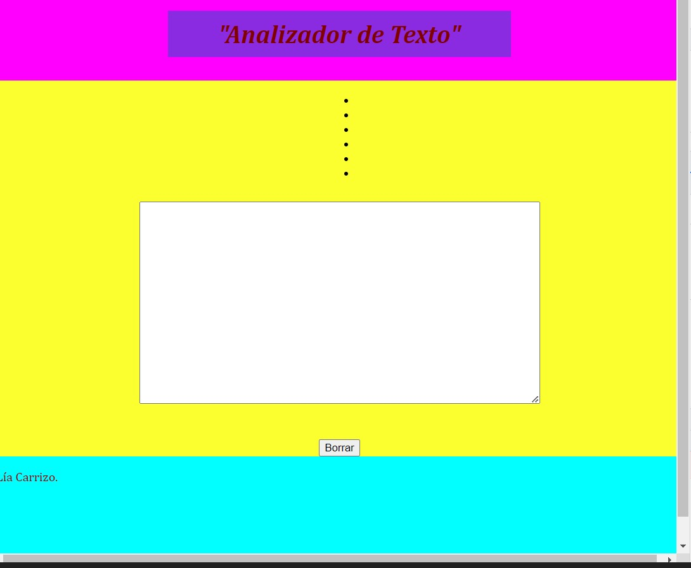
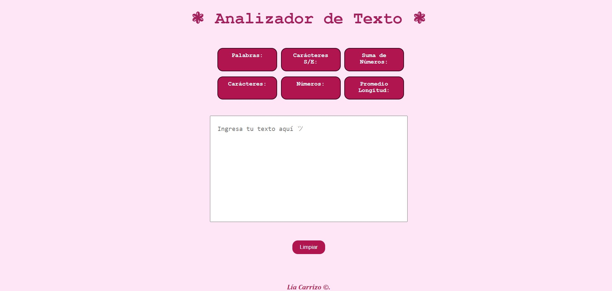

# "Analizador de texto"

Analizador de Texto es una herramienta web que permitirá a las usuarias, mediante distintas funcionalidades, analizar métricas de sus textos en tiempo real. Algunas de éstas métricas son: cantidad de palabras, carácteres, números, cantidad de palabras, entre otras. 
Además, cuenta con un botón para limpiar la caja de texto y a su vez las métricas, si así lo requiere.

## 1. Funcionalidades

  - [ ] Recuento de palabras: la aplicación debe poder contar el número de palabras en el texto de entrada y mostrar este recuento a la usuaria

  - [ ] Recuento de caracteres: la aplicación debe poder contar el número de caracteres en el texto de entrada, incluidos espacios y signos de puntuación, y mostrar este recuento a la usuaria.

  - [ ] Recuento de caracteres excluyendo espacios y signos de puntuación: la aplicación debe poder contar el número de caracteres en el texto de entrada, excluyendo espacios y signos de puntuación, y mostrar este recuento a la usuaria.

  - [ ] Recuento de números: la aplicación debe contar cúantos números hay en el texto de entrada y mostrar este recuento a la usuaria.

  - [ ] Suma total de números: la aplicación debe sumar todos los números que hay en el texto de entrada y mostrar el resultado a la usuaria.

  - [ ] Longitud media de las palabras: la aplicación debe calcular la longitud media de las palabras en el texto de entrada y mostrársela a la usuaria.

## 2. Prototipo Inicial

Sobre su diseño, el primer prototipo fue bastante básico, centrado en delimitar los espacios y estructura que tendría el Analizador de Texto. Para esto se utilizó una paleta de colores bastante fuerte, haciendo así mas notoria la delimitación. 

## 3. Prototipo Final

Para llegar al prototipo final se hicieron diversos cambios en la estructura del del Analizador de Texto, así como también en su paleta de colores. Además, también se contó con el feedback de varias usuarias, quienes sugirieron cambios en tonalidades y tamaño de fuente, hasta al fin llegar al diseño definitivo centrado en dar satisfacción a nuestras clientas.

